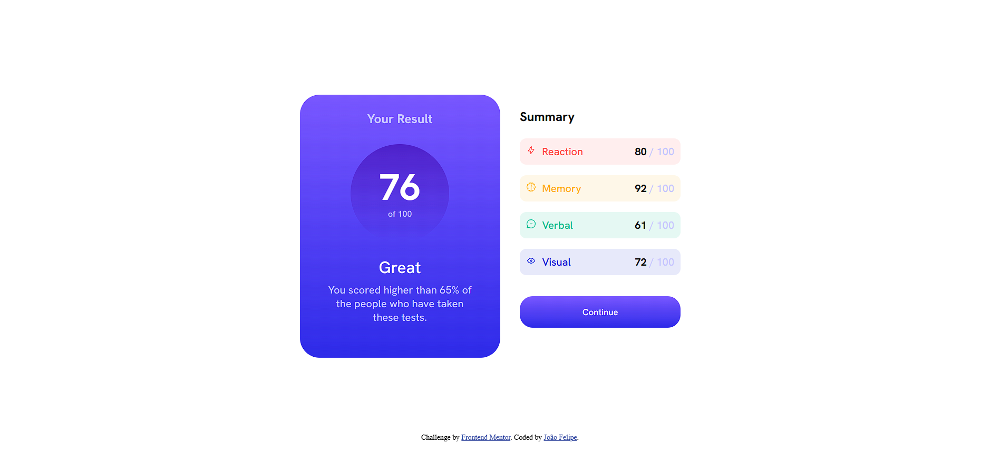

# Frontend Mentor - Results summary component solution

This is a solution to the [Results summary component challenge on Frontend Mentor](https://www.frontendmentor.io/challenges/results-summary-component-CE_K6s0maV). Frontend Mentor challenges help you improve your coding skills by building realistic projects. 

## Table of contents

- [Overview](#overview)
  - [The challenge](#the-challenge)
  - [Screenshot](#screenshot)
  - [Links](#links)
- [My process](#my-process)
  - [Built with](#built-with)
  - [What I learned](#what-i-learned)
  - [Continued development](#continued-development)
  - [Useful resources](#useful-resources)
- [Author](#author)
- [Acknowledgments](#acknowledgments)

## Overview

### The challenge

Users should be able to:

- View the optimal layout for the interface depending on their device's screen size
- See hover and focus states for all interactive elements on the page

### Screenshot



### Links

- Solution URL: [Add solution URL here](https://github.com/FelipeMT21/results-summary-component)
- Live Site URL: [Add live site URL here](https://felipemt21.github.io/results-summary-component/)

## My process

### Built with

- Semantic HTML5 markup
- CSS custom properties
- Flexbox
- CSS Grid
- Mobile-first workflow

### What I learned

I have learned a lot about how to use flexbox, grid, and lists, and I understand the best way to choose between them.

```html
<li class="desc desc-red"> Reaction</li>
```
```css
.proud-of-this-css {
background: linear-gradient(hsla(256, 72%, 46%, 1), hsla(241, 72%, 46%, 0));
}
```

### Continued development

To further enhance my design skills, I plan on delving deeper into Grid and Flexbox in order to gain a better understanding of these tools and use them more fluidly. This will expand my possibilities for creation and allow me to design more complex and sophisticated layouts.

### Useful resources

- [W3Sschools](https://www.w3schools.com/) - "This site helped me create buttons on many forms exactly the way I wanted."
- [Developer Mozilla MDN](https://developer.mozilla.org/pt-BR/) - This is an amazing article that helped me explore various possibilities to solve my challenge. I would recommend it to anyone who is still learning this concept.

## Author

- Website - [João Felipe](https://felipemt21.github.io/curriculo/)
- Frontend Mentor - [@FelipeMT21](https://www.frontendmentor.io/profile/FelipeMT21)

## Acknowledgments

I used the Mozilla Developer Network (MDN) and W3Schools extensively to help me solve my challenges.
